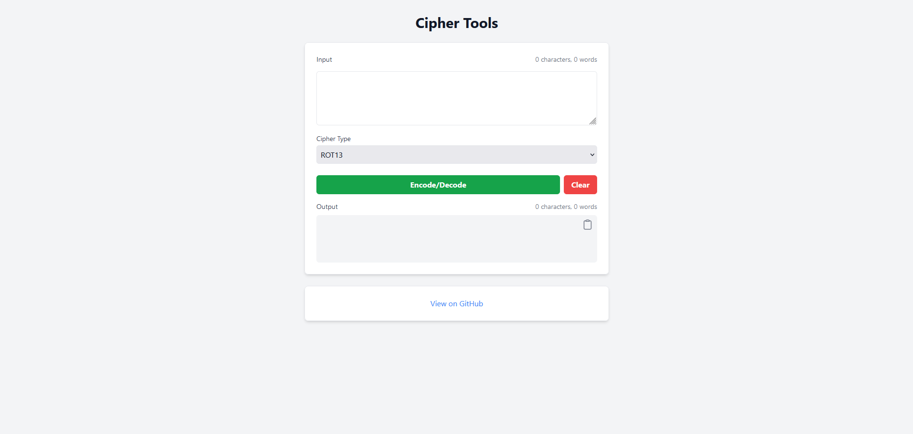

# Cipher Tools


A versatile web application for encoding and decoding text using various ciphers, built with HTML, JavaScript, and Tailwind CSS.



## Features

- 🔐 Support for multiple ciphers (ROT13, Caesar, Vigenère, etc.)
- 🔄 Encode and decode functionality for each cipher
- 📊 Real-time character and word count
- 📋 One-click copy to clipboard
- 🎨 Clean and responsive user interface built with Tailwind CSS
- ⚡ Fast and efficient processing with vanilla JavaScript
- 📱 Mobile-friendly design

## Supported Ciphers

1. ROT13
2. Caesar Cipher
3. Vigenère Cipher
4. More ciphers to be added in the future!

## How to Use

1. Select the desired cipher from the dropdown menu.
2. Enter your text in the input field.
3. For ciphers requiring a key (e.g., Caesar, Vigenère), enter the key in the provided field.
4. Click the "Encode" or "Decode" button to process the text.
5. The result will appear in the output field.
6. Use the "Copy" button to copy the result to your clipboard.
7. Click "Clear" to reset both input and output fields.

## Installation

No installation required, This is a web-based application. Simply clone the repository and open `index.html` in your web browser.

```bash
git clone https://github.com/yourusername/ciphers-app.git
cd ciphers-app
open index.html
```

## Technologies Used

- HTML5
- Tailwind CSS 3.0
- JavaScript (ES6+)

## Development

To modify the Tailwind CSS styles:

1. Install dependencies:
   ```
   npm install
   ```
2. Run the Tailwind CLI build process:
   ```
   npx tailwindcss -i ./src/input.css -o ./dist/output.css --watch
   ```
3. Edit the HTML and JavaScript files as needed. The CSS will automatically update.

## Contributing

Contributions, issues, and feature requests are always welcome, feel free to check [issues page](https://github.com/yourusername/ciphers-app/issues) if you want to contribute.

## License

This project is under [MIT](https://choosealicense.com/licenses/mit/) license.

## Contributors

**Johann Valenteros**

- GitHub: [@jvalenteros](https://github.com/jvalenteros)

**Michael Rodriguez**

- GitHub: [@MichaelDriguez](https://www.github.com/MichaelDriguez)
- LinkedIn: [Michael Rodriguez](https://www.linkedin.com/in/michael-driguez)
